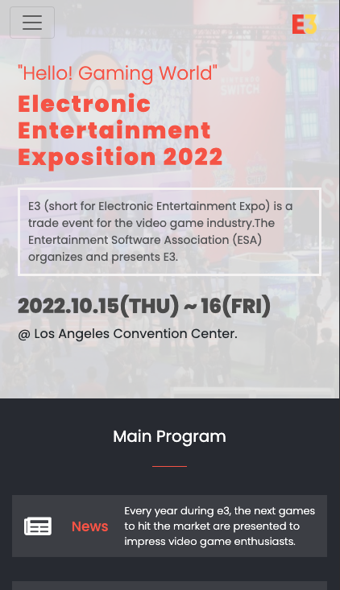

# E3 Electronic Entertainment Exposition 2022

> In this project, I have set up a E3 Digital Conference Website.

> Its an informative page to announce the next E3 ( Electronic Entertainment Exposition ), the biggest gaming event that will take place in Los Angeles Convention Center on 2022.

> [Informative Video about the Project!](https://www.loom.com/share/a4161791d7764bf29385445001a65e58)

## Built With

- HTML - CSS - JavaScript
- Git - Github - GitFlow

## Getting Started

To get a local copy up and running follow these simple example steps.

### Prerequisites

- Visual Studio Code or Sublime Text
- Git
- LiveServer Extension

### Setup

Go to the top of the page, press te green button that says "Code", and copy the link. Then you have to go to your console and type " git clone 'repository-url.com' ".

That's all, you are ready to go!

### Install

No extra dependencies needed to use the code!

### Usage

Add Live Server VSCode extension to deploy a local host server in order to start using it!

### Live Demo Server

- [E3 Website](https://ramiaquista.github.io/conference-website/)

## Authors

👤 **Author : Ramiro Aquistapace**

- GitHub: [@ramiaquista](https://github.com/ramiaquista)
- Twitter: [@ramiaq1](https://twitter.com/ramiaq1)
- LinkedIn: [RamiroAquistapace](https://www.linkedin.com/in/ramiro-aquistapace-32b61b204/)

👤 **Credits : Cindy Shin**

-License: [Cindy-Shin](https://www.behance.net/gallery/29845175/CC-Global-Summit-2015)

## 🤝 Contributing

Contributions, issues, and feature requests are welcome!

## Show your support

Give a ⭐️ if you like this project! 😄
